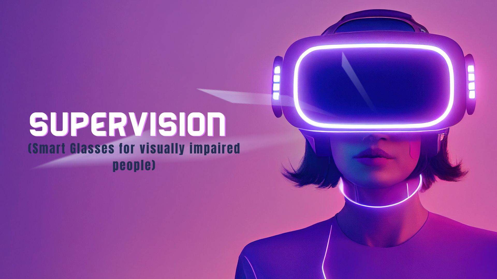
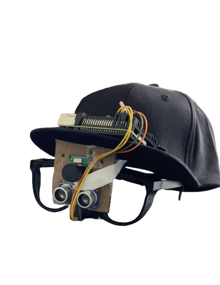

# SUPERVISION

## Overview
SUPERVISION is a revolutionary service technology for visually impaired individuals. It integrates:
- Object recognition
- Obstacle detection
- Scene recognition
- Optical Character Recognition (OCR)

These features provide hands-free environmental awareness and enhanced interaction.

---

## Features

### 1. **Object Recognition**
- Real-time object identification using CNNs.
- Descriptions created via NLP for user understanding.

### 2. **Scene Description**
- Contextual descriptions of surroundings (people, activities, and environment).
- Enhanced decision-making and situational awareness.

### 3. **Optical Character Recognition (OCR)**
- Converts printed text to digital format.
- Text-to-speech functionality for accessibility.

### 4. **Obstacle Detection**
- Depth sensors and machine learning for real-time alerts.
- Audio guidance ensures user safety.

---
## Model Design

## Challenges

### 1. **Hardware Optimization**
- Designing lightweight, ergonomic smart glasses.

### 2. **Data Diversity and Accuracy**
- Building robust machine learning models with diverse datasets.

### 3. **Real-time Processing and Latency**
- Ensuring low latency for seamless feedback.

---

## Methodology
SUPERVISION integrates:

### **Hardware**
- **High-resolution cameras** for object detection.
- **Depth sensors** for obstacle detection.
- **Microphones** for sound enhancement.

### **Software**
- **Object Recognition** using CNNs.
- **Scene Analysis** through computer vision and NLP.
- **Speech Interaction** with text-to-speech and voice commands.

---

## Applications
- Safe navigation and obstacle avoidance.
- Reading printed materials (books, menus, signs).
- Enhanced situational awareness.
- Increased confidence in social and professional settings.

---

## Keywords
- Blind Assistance
- Natural Language Processing
- Depth Sensor Technology
- IoT and Sensor Interaction
- Artificial Intelligence

---

## How to Use
1. Wear the smart glasses.
2. Use voice commands or gestures to initiate functions.
3. Receive audio feedback and guidance.
4. Navigate safely with real-time alerts.

---

## Future Scope
- Improved AI for better accuracy.
- Integration with IoT devices.
- Customizable user interfaces.

---

## Contact
For more information:
- GitHub: [https://github.com/Sayee21/SUPERVISION]
